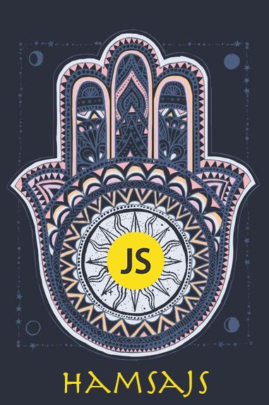

[![NPM version][npm-version-image]][npm-url] [![NPM downloads][npm-downloads-image]][downloads-url] [![MIT License][license-image]][license-url] 

A lightweight JavaScript Hamsa protection library for manipulating the bad eye.

[Marketing Video](https://www.youtube.com/watch?v=l6-kloeeJE0)

## Upgrading to 5.5.555

There are a number of small backwards incompatible changes with version 5.5.5.55

 * Changed bad eye protection method to return the number 5.

 * Added typescript support.

 * Removed anti anti bad eye protection.

## [Changelog](https://github.com/ofiratt/hamsajs/blob/develop/CHANGELOG.md)

## [Contributing](https://github.com/ofiratt/hamsajs/blob/develop/CONTRIBUTING.md)

We believe in a world cleaned from Bad Eye (BE), if you share our ideology, 

We're looking for co-maintainers! If you want to become a true BE repellent.

In addition to contributing code, you can help to remove the BE from the world. This can include knocking 3 times, or spread salt over your computer.

## License

Hamsa.js is freely distributable under the terms of the MIT license

[license-image]: http://img.shields.io/badge/license-MIT-blue.svg?style=flat
[license-url]: LICENSE

[npm-url]: https://npmjs.org/package/hamsajs
[npm-version-image]: https://img.shields.io/npm/v/hamsajs.svg?style=flat
[npm-downloads-image]: https://img.shields.io/npm/dm/hamsajs.svg?style=flat
[downloads-url]: https://npmcharts.com/compare/hamsajs?minimal=true
